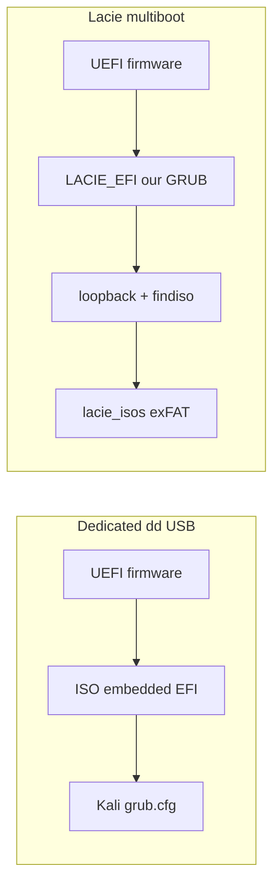

# Lacie multiboot vs dedicated Kali USB — lessons learned

Notes from May 2026: loopback Kali on lacie failed in several ways; a direct
`dd` of `kali-linux-2026.1-live-everything-amd64.iso` to a 30G stick boots
under **Legacy/CSM** on cluster laptops. **UEFI also fails on that dd stick** —
so UEFI trouble is **not lacie-specific**; treat as **target firmware + boot
menu + Kali ISO** first, then lacie GRUB.

Related: [kali-lacie-boot.md](kali-lacie-boot.md), [modules/hosts/lacie/configuration.nix](../../modules/hosts/lacie/configuration.nix) (imaging / disk wiring).

## What worked (dedicated USB, `/dev/sdb` dd)

| Aspect | Behavior |
|--------|----------|
| Write method | `write-kali-usb.sh` → full-disk `dd` of isohybrid ISO |
| Firmware view | Whole disk = Kali Live (iso9660 + small FAT EFI stub) |
| GRUB | **Kali’s own** menu (live, persistence, installer, utilities) |
| Installer | Finds installation media (no “incorrect installation media”) |
| Boot mode | **Legacy works**; **UEFI fails** on same OptiPlex-class hardware as lacie |

**Takeaway:** Kali expects to **be** the boot device for loopback/installer
reliability, but **dd does not fix UEFI** on our cluster laptops. Lacie multiboot
and dedicated dd share the same UEFI failure mode → fix BIOS/menu/firmware path
before investing in lacie EFI GRUB alone.

## What lacie does differently

```text
p1  LACIE_EFI   FAT32   Custom GRUB (Kanagawa) + grubx64.efi  ← firmware boots here (UEFI)
p2  lacie_isos  exFAT   *.iso files (loopback targets)
p3  live_nix    ext4    NixOS root (may also host staged ISO copy)
p4  persistent_data  NTFS
```

```text
  [UEFI firmware]
       → LACIE_EFI/grubx64.efi (our GRUB)
       → loopback ISO on lacie_isos (exFAT)
       → linux/initrd from (loop) inside ISO
       → initrd must find ISO file on exFAT by path (findiso=)
```

This is **not** the layout isohybrid installers are tested against.

## Failure modes we hit on lacie

| Symptom | Likely cause |
|---------|----------------|
| `file /live/vmlinuz-* not found` | Chained `configfile (loop)/boot/grub/grub.cfg` without `set root=(loop)` — inner paths resolved against EFI FAT, not ISO |
| No Kali submenu / missing installer | Single flattened `menuentry` (only first live line); submenu installer lacks `findiso=` |
| “Incorrect installation media detected” | d-i gtk installer booted without `findiso=`; exFAT + loopback not in Debian/Kali installer initrd test matrix |
| Live WiFi / can’t write to disk | Default live overlay is RAM-only; need persistence partition + persistence boot entry |
| **UEFI crash/hang; Legacy works** | See below — open issue |

## UEFI vs Legacy (observed on cluster hardware)

**Observed (both media):**

| Media | Legacy/CSM | Pure UEFI |
|-------|------------|-----------|
| Lacie multiboot (our GRUB + exFAT ISO) | Works | Fails / hang |
| Dedicated 30G stick (`dd` live-everything) | Works | Fails |

**Implication:** Do **not** blame lacie loopback/GRUB for UEFI until a **dd stick
boots under UEFI** on the same machine with the same BIOS settings. Until then,
prioritize **firmware and boot entry selection** (and known Kali+UEFI quirks).

### Target machine checklist (OptiPlex / Dell)

1. **Secure Boot: Disabled** (Kali live GRUB is not SB-signed on most images).
2. **Boot mode:** For UEFI test use **UEFI only** (disable CSM/Legacy for that
   test). For day-to-day Kali deploy, **Legacy + dd/lacie** is the working path
   today.
3. **F12 menu — pick the right row:**
   - Legacy path: often `USB Flash Drive`, `USB HDD`, or no `UEFI:` prefix.
   - UEFI path: must be **`UEFI: <vendor>`** or **`UEFI: Samsung`** — not the
     legacy duplicate of the same stick.
4. **USB port:** Try **rear USB 2.0** if front/USB3 UEFI boot is flaky.
5. **Fast Boot / USB boot** enabled; optional **USB boot first** for one-shot test.

### Cerberus verify (stick plugged in after `dd`)

```bash
lsblk -o NAME,SIZE,LABEL,FSTYPE,PARTTYPE,PARTFLAGS /dev/sdX
# Expect: p1 iso9660 (Kali Live), p2 vfat ESP with EFI boot files
sudo mount /dev/sdX2 /mnt && ls -la /mnt/EFI/BOOT/ && sudo umount /mnt
```

If **p2 vfat + BOOTX64.EFI** exists but hardware UEFI still fails → **firmware or
Kali ISO vs that UEFI** (see Kali [#8737](https://bugs.kali.org/view.php?id=8737)
older UEFI hang; [#9126](https://bugs.kali.org/view.php?id=9126) GRUB rescue on
some Thinkpads — Ventoy workaround).

### Lacie-only hypotheses (after dd UEFI is ruled out)

Still worth fixing for multiboot, but **secondary** while dd UEFI is broken:

1. Broken `grub-install` on `LACIE_EFI` (run inside `nix-shell -p grub2_efi`).
2. Bootstrap vs NixOS `grub.cfg` drift after `nixos-install` on `live_nix`.
3. exFAT initrd gap for loopback live (Debian [#1060346](https://bugs.debian.org/cgi-bin/bugreport.cgi?bug=1060346)).
4. Wrong block device (`/dev/sdb` vs `/dev/sda`) when refreshing GRUB.

### Workarounds while UEFI is broken

| Goal | Approach |
|------|----------|
| Boot Kali now | **Legacy/CSM ON**, F12 → non-UEFI USB entry |
| Install Kali | Legacy-boot dd stick or lacie; or **smaller installer-amd64.iso** (retest UEFI) |
| UEFI-only site policy | Ventoy on FAT32 ESP + ISO folder; or rEFInd on ESP; or distro with signed shim |
| NixOS recovery on lacie | Test **home-office-installer** under UEFI separately — if NixOS UEFI works but Kali does not, confirms Kali/firmware not lacie layout |

**Repro checklist (next lacie attach):**

```bash
./scripts/recovery-preflight.sh --device /dev/sdb
ls -la /boot/grub/   # on mounted LACIE_EFI — grub.cfg, grubx64.efi, themes, i386-efi/x86_64-efi
# QEMU Tier 2/3: scripts/setup-nix-usb.QA.md
# Hardware: F12 UEFI vs F12 Legacy, same Kali submenu entry, capture serial if possible
```

## Architectural options for fixing lacie Kali

| Option | Pros | Cons |
|--------|------|------|
| **A. Keep loopback, fix GRUB** (current direction) | No repartition; multiple ISOs | exFAT initrd gap; installer fragile; UEFI GRUB must be bulletproof |
| **B. Stage ISO on ext4 `live_nix`** | Installer + findiso more reliable | 16G duplicate; `stage-kali-for-install.sh` |
| **C. Shrink `lacie_isos`, add ext4 `kali_staging`** | ISOs that need install on ext4; exFAT for large NixOS ISOs | Repartition once |
| **D. Replace exFAT with ext4 for `lacie_isos`** | Single fs module (ext4) in initrds | Windows/macOS read pain; 63G commit |
| **E. Dedicated Kali stick (dd)** | Works on **Legacy**; no lacie GRUB | Extra USB; **does not fix UEFI** on our hardware |
| **F. Use installer ISO only on lacie** | Smaller; closer to upstream | Live-everything tools not on installer image; still loopback limits |

**Recommended target state:**

- **Live / pentest:** lacie submenu (`root=(loop)` + `source`) + persistence partition.
- **Install to bare metal:** dedicated dd stick **or** ext4-staged copy + top-level installer entry — not submenu d-i alone.
- **UEFI:** fix **target BIOS + boot entry** first; then lacie `grub-install` / NixOS vs Kali UEFI matrix on same box.

## Code/docs already aligned (partial fix)

- `generate_debian_live_entry` → submenu + `findiso` installer menuentry
- `stage-kali-for-install.sh` → ext4 copy on `live_nix`
- `write-kali-usb.sh` → escape hatch (proven)
- `recovery-preflight.sh` → Kali block shape checks

## Open work (lacie fix backlog)

- [ ] Reproduce UEFI failure with serial log / photo of screen
- [ ] Confirm `LACIE_EFI` has working `EFI/BOOT/grubx64.efi` + `x86_64-efi/*.mod` including `exfat`, `loopback`
- [ ] After `--grub-only`, verify **runtime** `live_nix` boot still uses same `iso-entries.cfg` (NixOS grub path)
- [ ] QEMU Tier 2 boot lacie partitions under OVMF (UEFI) vs SeaBIOS (Legacy)
- [ ] Test Kali live on exFAT after submenu fix; if initrd fails, test ext4 staging or `lacie_isos` → ext4 migration plan
- [ ] Persistence partition for laptop deploy (`setup-kali-persistence.sh`)
- [ ] Document “use dd stick for install” vs “use lacie for live” in cluster runbooks

## Comparison diagram



Dedicated dd: one boot chain, one vendor GRUB, firmware-native layout.

Lacie: two vendors (our GRUB + Kali’s internal cfg), cross-partition ISO file, exFAT in the loop.
