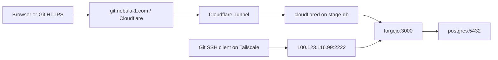

# OCI hosts and Forgejo routing

Operational snapshot: 2026-09-06, America/Chicago. Both OCI A1 ARM64 instances
were converted to NixOS and enrolled in Tailscale on August 13. The Forgejo
deployment completed September 6. Oracle Linux preparation instructions and
the earlier Caddy design are historical; routine changes use NixOS activation.

| Host | OCI private IP | Tailscale IP | Role |
| --- | --- | --- | --- |
| `stage-db` | `10.0.6.242` | `100.123.116.99` | Forgejo, PostgreSQL, cloudflared |
| `stage-edge` | `10.0.83.89` | `100.113.209.112` | Separate staging edge host |

The hosts have private OCI addresses and NAT egress. Administration uses
Tailscale SSH transport to the host's OpenSSH service; OCI Bastion port
forwarding is the emergency path. The Oracle Cloud Agent managed-SSH method
does not survive the move to NixOS. Do not run disko or nixos-anywhere against
these installed hosts as an update procedure.

## Public HTTPS and private SSH

`cloudflared` initiates outbound connections; no public OCI HTTP/HTTPS ingress
was added. OpenTofu manages tunnel `nebula-1-forgejo`
(`e110775f-3602-4eb5-8cd3-e2ea20d987ce`) and the proxied CNAME
`git.nebula-1.com → e110775f-3602-4eb5-8cd3-e2ea20d987ce.cfargotunnel.com`.
Only the `git` hostname routes to `http://forgejo:3000`; other tunnel requests
receive 404. The apex `nebula-1.com` was not changed.

Git SSH uses Tailscale port 2222 and the host mapping in the
[Forgejo runbook](../../infra/forgejo/README.md#administrator-and-signup).
Neither Forgejo HTTP nor PostgreSQL is published on a host port. The Docker
forwarding guard allows the Git SSH port only from `tailscale0` and is restored
after Docker restarts. Forgejo trusts proxy headers only from the connector's
fixed container address `172.30.42.2`.

## Configuration ownership

| Concern | Source |
| --- | --- |
| OCI baseline, disks, SSH, Tailscale | `modules/hosts/_oci-common.nix` |
| Forgejo host and 1/2 GiB Nix GC thresholds | `modules/hosts/stage-db/configuration.nix` |
| Service lifecycle, firewall, backup timer | `modules/services/forgejo.nix` |
| Pinned containers, signup and URL settings | `infra/forgejo/compose.yaml` |
| Cloudflare resources | `infra/forgejo/main.tf` |
| Reproducible tools | Root `flake.nix`, `nix develop .#forgejo` |

Application secrets live in `/etc/forgejo/.env.local`, generated once on the
server. OpenTofu produces `.env.tf` with the tunnel token; deployment replaces
only that file. API credentials, environment files, plans, and state are
excluded from Git and must have private permissions. The Cloudflare token is
scoped to account Tunnel Edit and zone DNS Edit / Zone Read.

The stage-db boot disk is about 46 GiB. Its Nix GC thresholds override desktop
defaults that exceeded total disk capacity and caused repeated garbage
collection during remote builds.

## Operations

See the [Forgejo runbook](../../infra/forgejo/README.md) for deployment, account
activation, local daily backups, and isolated recovery checks. Both `warbee`
and `lain` are Forgejo administrators; this does not create OS accounts or
grant Tailscale membership. New registrants require manual activation.

Jovan has an explicit, separate root SSH grant on `stage-db`, using the ed25519
key registered to `lain` in Forgejo (`jovan@VE-18022026657`). It is declared in
`modules/hosts/stage-db/configuration.nix`. From a device with Tailscale access
and that private key, connect with `ssh root@100.123.116.99` (host SSH port 22).
This grant does not apply to `stage-edge`.

The existing [Cerberus infrastructure demo](README.md) is a separate disabled
workstation stack. Its database migration work is not part of this OCI deployment.
